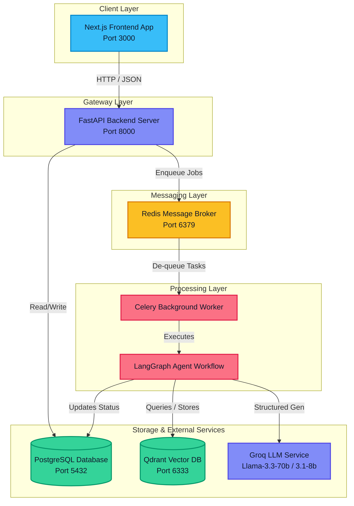
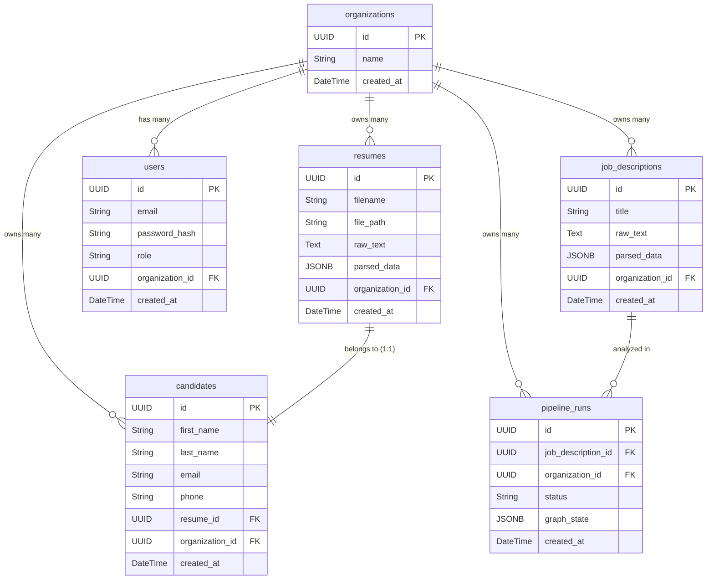

# Agentic AI Hiring Copilot 🚀

A production-grade, multi-tenant SaaS application designed to automate recruiter workflows. It leverages **FastAPI**, **Next.js**, **Celery**, **PostgreSQL**, **Qdrant Vector Database**, and **AI Agents** (via LangGraph and Groq) to parse resumes, execute semantic searches, and run structured candidate screening pipelines.

---

## 🛠️ Technology Stack

| Layer | Technology |
| :--- | :--- |
| **Frontend** | Next.js (v16 App Router), React Query (v5), Tailwind CSS (v4), Zustand, Lucide Icons |
| **Backend API** | FastAPI (Python 3.10), SQLAlchemy ORM, Uvicorn |
| **Background Processing** | Celery Task Queue, Redis Broker |
| **Relational Database** | PostgreSQL |
| **Vector Database** | Qdrant (Semantic Search & Candidate Vector Storage) |
| **AI & LLM Services** | LangChain, LangGraph, Groq API (Llama 3.3 70B & Llama 3.1 8B), Sentence Transformers (`BAAI/bge-small-en-v1.5` embeddings) |

---

## 📐 System Architecture

Below is the high-level architecture diagram showing the relationship between services.



---

## 🔄 Major Project Workflow

```
[Candidate CV Upload] ──> FastAPI ──> Celery Worker ──> extract text ──> LLM parses CV ──> Vectorized in Qdrant
                                                                                                  │
                                                                                                  ▼
[Job Screening] ───────> FastAPI ──> Celery Worker ──> LangGraph Multi-Agent Workflow ──────> Match Results
```

### 1. Resume Upload & Processing Flow
1. Recruiter uploads a resume (`.pdf`, `.docx`, or `.txt`) on the frontend dashboard.
2. FastAPI saves the document to a local folder and creates a `resumes` record in **PostgreSQL** with empty `parsed_data`.
3. An asynchronous task (`process_resume_task`) is dispatched to **Celery** via **Redis**.
4. The worker extracts text using `pdfplumber` (with `pytesseract` OCR fallback) or `docx2txt`.
5. The **ResumeParserAgent** invokes the Groq LLM (Llama 3.3 70B) to parse the text into a structured JSON profile (skills, experience, education, personal info).
6. The candidate profile is saved in PostgreSQL, converted to a search vector (`BAAI/bge-small-en-v1.5`), and indexed in **Qdrant** isolated by tenant/organization ID.

### 2. Candidate Screening & Matching Flow
1. Recruiter creates a Job Description (JD) and clicks **Screen Candidates**.
2. FastAPI triggers `run_matching_pipeline_task` in Celery.
3. Celery initializes and executes the **LangGraph Multi-Agent Workflow** (detailed below).
4. Once completed, the final state, scores, gap analysis, and tailored questions are saved in PostgreSQL, and the frontend automatically displays the matches.

---

## 🤖 Agentic Workflow (LangGraph)

The screening pipeline is implemented as a state graph running structured agents sequentially:

```mermaid
graph LR
    classDef agent fill:#A5B4FC,stroke:#6366F1,stroke-width:2px,color:#0F172A;
    classDef start fill:#CBD5E1,stroke:#64748B,stroke-width:2px,color:#0F172A;

    START([Start Pipeline]):::start
    RP[Resume Parser Agent<br/>Parse uploaded CV text]:::agent
    JD[JD Analyzer Agent<br/>Extract requirements & title]:::agent
    CR[Candidate Retrieval Agent<br/>Search Qdrant for similar CVs]:::agent
    MA[Matching Agent<br/>Compare CVs with requirements]:::agent
    SG[Skill Gap Agent<br/>Evaluate technical discrepancies]:::agent
    IG[Interview Generator Agent<br/>Create custom questions]:::agent
    AG[Assessment Generator Agent<br/>Build coding challenges]:::agent
    RA[Ranking Agent<br/>Rank candidates based on fit]:::agent
    END([Save Results & Finish]):::start

    START --> RP
    RP --> JD
    JD --> CR
    CR --> MA
    MA --> SG
    SG --> IG
    IG --> AG
    AG --> RA
    RA --> END
```



*   **Resume Parser Agent:** Invoked asynchronously during resume uploads to parse unstructured text (PDF/DOCX/TXT) and extract structured candidate profiles (personal details, skills, education, and work experience).
*   **JD Analyzer Agent:** Extracts core required skills, preferred skills, and experience criteria from the raw Job Description text.
*   **Candidate Retrieval Agent:** Vectorizes the job criteria and queries Qdrant for the top 5 semantically matching candidates under the recruiter's tenant.
*   **Matching Agent:** Compares candidate profiles with job requirements to calculate individual fit scores (0-100), key strengths, and overall summaries.
*   **Skill Gap Agent:** Compares candidate skills against job required skills, identifying exact technical discrepancies.
*   **Interview Generator Agent:** Generates tailored, role-specific technical interview questions to test the candidate's gaps.
*   **Assessment Generator Agent:** Develops custom coding challenges and multiple-choice questions matching the job description.
*   **Ranking Agent:** Aggregates and ranks candidates to establish a leaderboard.

---

## 🗄️ Database Entity Relationship (ER) Diagram

Below is the database relationship diagram mapping all the schemas, columns, and keys exactly as defined in the PostgreSQL database.



### Table Details
1.  **`organizations`**: Represents tenant companies. Every company gets its own record to isolate data securely.
2.  **`resumes`**: Stores the raw uploaded document metadata, file paths, raw text, and structured JSON parsing results.
3.  **`candidates`**: Extracted candidate profiles (first name, last name, email, phone) linked 1-to-1 with their resume.
4.  **`users`**: Represents company recruiters who can log in, edit job catalogs, and manage campaigns.
5.  **`job_descriptions`**: Contains job requirements (title, raw requirements, and key skills parsed by the JD agent).
6.  **`pipeline_runs`**: Represents screening pipeline runs. Tracks status (pending, running, completed, failed) and stores the LangGraph workflow's final output state.

---

## 🚀 How to Execute the Project

### ⚠️ Port Conflicts Warning (Important)
If you switch between running the application locally on your host machine and running it via Docker, you **must stop** the local services before starting Docker, and vice-versa. Two services cannot use the same port simultaneously:

| Service | Port Used | Action before running Docker | Action before running Locally |
| :--- | :--- | :--- | :--- |
| **Qdrant** | `6333` & `6334` | Close the terminal running `qdrant.exe`. | Stop the Qdrant Docker container. |
| **PostgreSQL** | `5432` | Stop your local PostgreSQL service. | Stop the Postgres Docker container. |
| **Redis** | `6379` | Stop your local Redis service. | Stop the Redis Docker container. |

---

### Option A: Run with Docker Desktop (Recommended)

Make sure **Docker Desktop** is open and running on your computer.

1.  **Start all services in Docker:**
    ```powershell
    docker-compose up
    ```
2.  **Seed the database with sample jobs and resumes (Run in a separate PowerShell window):**
    ```powershell
    docker exec -it hiring_copilot_backend python seed_demo.py
    ```

#### Docker Stopping & Lifecycle Management:
*   **To Pause/Stop the application (keeps your database data intact):**
    ```powershell
    docker-compose stop
    ```
    *(Pressing `Ctrl + C` in your active terminal also stops the containers safely).*
*   **To Stop and Remove the containers completely (keeps database data intact):**
    ```powershell
    docker-compose down
    ```
*   **To Reset and Wipe the database volumes completely (starts 100% fresh):**
    ```powershell
    docker-compose down -v
    ```

#### Docker Application URLs:
*   **Frontend (Next.js App):** `http://localhost:3000`
*   **Backend API (Swagger Docs):** `http://localhost:8000/docs`
*   **Qdrant Database Console:** `http://localhost:6333/dashboard`
*   **Adminer (Database Web UI):** `http://localhost:8080` (Server: `postgres`, DB: `hiring_copilot`, User/Password: `postgres`)

---

### Option B: Run Locally on Host Machine (Without Docker)

To run the application natively on your host machine, you must first install and start the following required software:

#### 📋 Prerequisites to Install
1.  **Node.js (v20.9.0 or higher):** Required to run the Next.js frontend dev server. Download from [nodejs.org](https://nodejs.org/).
2.  **Python (v3.10.x):** Required to run the FastAPI backend and Celery workers. Download from [python.org](https://www.python.org/).
3.  **PostgreSQL (v15 or higher):** The relational database. Install locally and ensure the service is running. Download from [postgresql.org](https://www.postgresql.org/).
4.  **Redis (v6 or higher):** The message broker for Celery. 
    *   *Windows users:* Install Redis via WSL (Windows Subsystem for Linux) or download the native MSI installer (e.g. from [Memurai](https://www.memurai.com/) or Github archives).
5.  **Qdrant Vector Database:** The vector search store.
    *   *Native Windows Installation:* Download the Windows release zip (e.g. `qdrant-x86_64-pc-windows-msvc.zip`) from [Qdrant GitHub Releases](https://github.com/qdrant/qdrant/releases). Extract the folder and you will find `qdrant.exe` and `config.yaml`.

---

#### 🏃‍♂️ Local Execution Steps

##### 1. Start Databases & Message Brokers
*   **Start Redis:** Ensure your local Redis server is running (usually listening on port `6379`).
*   **Start PostgreSQL:** Ensure your local PostgreSQL service is running (usually listening on port `5432`).
*   **Start Qdrant Natively (Windows):** Open a terminal in your extracted Qdrant folder and run:
    ```powershell
    .\qdrant.exe
    ```
    *(Alternatively, if you have Docker running but want the app code running locally, you can start Qdrant via Docker: `docker run -p 6333:6333 -p 6334:6334 -v qdrant_storage:/qdrant/storage qdrant/qdrant`)*.

##### 2. Setup Backend
1. Open a terminal and navigate to the `backend` folder:
   ```powershell
   cd backend
   ```
2. Create and activate a Python virtual environment:
   ```powershell
   python -m venv venv
   .\venv\Scripts\activate
   ```
3. Install dependencies:
   ```powershell
   pip install -r requirements.txt
   ```
4. Configure your `.env` file in the `backend` folder. Make sure to specify your `GROQ_API_KEY` and point the `DATABASE_URL`, `REDIS_URL`, and `QDRANT_HOST` to your locally running services (e.g., `localhost`).
5. Start the backend API server:
   ```powershell
   uvicorn app.main:app --reload --host 127.0.0.1 --port 8000
   ```
6. Start the Celery worker (Open a new terminal, activate virtual environment, and run):
   ```powershell
   celery -A celery_worker.celery_app worker --loglevel=info
   ```
7. Seed the database (Optional):
   ```powershell
   python seed_demo.py
   ```

##### 3. Setup Frontend
1. Open a terminal and navigate to the `frontend` folder:
   ```powershell
   cd frontend
   ```
2. Install npm packages:
   ```powershell
   npm install
   ```
3. Start the Next.js development server:
   ```powershell
   npm run dev
   ```

#### Local Host Application URLs:
*   **Frontend App:** `http://localhost:3000`
*   **Backend Swagger Docs:** `http://localhost:8000/docs`
*   **Qdrant local dashboard:** `http://localhost:6333/dashboard`
